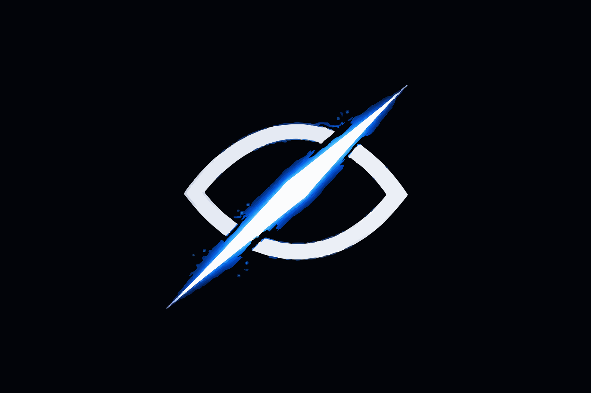

<p align="center">
  <picture>
    <source media="(prefers-color-scheme: dark)" srcset="demo/public/logo.svg">
    
  </picture>
</p>

<h1 align="center">StellaRay</h1>

<p align="center">
Zero-knowledge authentication for Stellar.<br>
Sign in with Google. Get a self-custodial wallet. No seed phrases. No extensions.
</p>

<p align="center">
  <a href="https://www.npmjs.com/package/@stellar-zklogin/sdk"></a>
  <a href="LICENSE"></a>
  <a href="https://stellaray.fun"></a>
</p>

<br>

## The Problem

Blockchain wallets are the biggest barrier to adoption. Users are expected to install browser extensions, write down 24-word seed phrases, and understand cryptographic concepts before they can do anything. The result: **95% of users drop off before completing onboarding.**

## The Solution

StellaRay lets users sign in with Google and instantly get a fully functional Stellar wallet. Under the hood, we use zero-knowledge proofs to link the Google identity to a wallet address without ever exposing that link on-chain. The wallet is deterministic (same Google account = same address, every time) and fully self-custodial.

No extensions. No seed phrases. No compromise on security.

<br>

## Quick Start

```bash
npm install @stellar-zklogin/sdk
```

```typescript
import { createWallet } from '@stellar-zklogin/sdk';

const wallet = createWallet({
  appName: 'My dApp',
  oauthClients: { google: 'YOUR_CLIENT_ID' },
});

const account = await wallet.connect('google');
console.log(account.address); // GABCD...
```

That's it. Three lines and your user has a wallet.

<br>

## How It Works

```
  Sign in with Google
         |
         v
  Google returns a JWT
         |
         v
  Browser generates ephemeral keypair
         |
         v
  ZK proof: "I own a valid Google JWT with this nonce"
  (email, name, user ID stay hidden)
         |
         v
  Smart contract verifies the proof on-chain
         |
         v
  Ephemeral key authorized to sign transactions
```

The wallet address is derived from `Poseidon(sub, aud, salt)`. Same inputs always produce the same address, but the mapping is impossible to reverse without the salt. Your Google identity never touches the blockchain.

**Privacy by default:**
- OAuth identity never appears on-chain
- Same user always gets the same wallet (deterministic)
- Different users cannot be linked (salt isolation)
- ZK proof reveals zero information about you

<br>

## Built on Protocol 25

Stellar's Protocol 25 introduced native cryptographic primitives that make ZK proofs practical on-chain. StellaRay is the first project to use them in production.

| | Before Protocol 25 | With Protocol 25 |
|---|---|---|
| Groth16 verification | 4,100,000 gas | 260,000 gas |
| Poseidon hash | 500,000 gas | 50,000 gas |
| Full login cost | ~$0.50 | **$0.03** |

We use `bn254_g1_add`, `bn254_g1_mul`, `bn254_multi_pairing_check` for elliptic curve operations and `poseidon_permutation` for ZK-friendly hashing. All running natively on Soroban.

<br>

## Architecture

```
+--------------------------------------------------+
|                  User's Browser                   |
|     OAuth JWT  >  ZK Proof  >  Ephemeral Keys     |
+-------------------------+------------------------+
                          |
           +--------------+--------------+
           v              v              v
     +----------+   +----------+   +----------+
     |  Prover  |   |   Salt   |   |  Stellar |
     | Service  |   | Service  |   | Network  |
     +----------+   +----------+   +----------+
                          |
                          v
+--------------------------------------------------+
|            Soroban Smart Contracts                |
|   ZK Verifier . JWK Registry . Gateway Factory    |
|   Smart Wallet . x402 Facilitator                 |
+--------------------------------------------------+
```

<br>

## What You Can Build

**ZK Login**
Sign in with Google, get a Stellar wallet. Full self-custody through zero-knowledge cryptography. Apple Sign-In coming soon.

**Streaming Payments**
Set up real-time payment streams between wallets. Pay by the second. Cancel anytime. Built on Stellar's fast finality.

**Payment Links**
Generate shareable payment URLs with embedded QR codes. Accept payments without requiring the sender to install anything.

**ZK Proofs**
Prove things about your wallet without revealing the details:
- Proof of solvency (you have enough funds, without showing your balance)
- Identity verification (you are who you say, without exposing personal data)
- Eligibility proofs (you qualify, without showing why)
- Transaction history proofs (you've transacted, without revealing with whom)

**Multi-Custody Recovery**
Split wallet access across multiple parties using Shamir secret sharing. Recover your wallet even if you lose access to one device.

**React Components**
Pre-built `<LoginButton>`, `<WalletWidget>`, hooks like `useZkLogin()` and `useWallet()`. Drop them into any React app.

<br>

## Performance

| Metric | Value |
|--------|-------|
| Proof generation (browser) | 2-4s |
| Transaction confirmation | ~5s |
| First login (full flow) | 8-10s |
| Return login | 3-5s |
| On-chain verification | $0.03 |

<br>

## Project Structure

```
StellaRay/
├── sdk/                  TypeScript SDK (@stellar-zklogin/sdk)
│   └── src/
│       ├── core/         Stellar and Soroban primitives
│       ├── oauth/        Google and Apple OAuth providers
│       ├── react/        React hooks and components
│       ├── x402/         HTTP payment protocol
│       └── xray/         Protocol 25 integration
├── contracts/            Soroban smart contracts (Rust)
│   ├── zk-verifier/      Groth16 proof verification
│   ├── smart-wallet/     Session-based wallet management
│   ├── gateway-factory/  Deterministic wallet deployment
│   ├── jwk-registry/     OAuth provider key storage
│   └── zk-multi-custody/ Multi-party wallet recovery
├── demo/                 Next.js application (stellaray.fun)
├── circuits/             Circom ZK circuits
├── prover/               Proof generation service (Rust)
└── salt-service/         Salt derivation service (Rust)
```

<br>

## Deployed Contracts (Testnet)

| Contract | Explorer |
|----------|----------|
| ZK Verifier | [CDAQXH...CP6](https://stellar.expert/explorer/testnet/contract/CDAQXHNK2HZJJE6EDJAO3AWM6XQSM4C3IRB5R3AJSKFDRK4BZ77PACP6) |
| JWK Registry | [CAMO5L...S2I](https://stellar.expert/explorer/testnet/contract/CAMO5LYOANZWUZGJYNEBOAQ6SAQKQO3WBLTDBJ6VAGYNMBOIUOVXGS2I) |
| Gateway Factory | [CAAOQR...F76](https://stellar.expert/explorer/testnet/contract/CAAOQR7L5UVV7CZVYDS5IU72JKAUIEUBLTVLYGTBGBENULLNM3ZJIF76) |
| x402 Facilitator | [CDJMT4...TZZ](https://stellar.expert/explorer/testnet/contract/CDJMT4P4DUZVRRLTF7Z3WCXK6YJ57PVB6K7FUCGW7ZOI5LDFAWBWTTZZ) |

<br>

## Run Locally

**Prerequisites:** Node.js 18+, Rust 1.75+, pnpm

```bash
git clone https://github.com/Adwaitbytes/StellaRay.git
cd StellaRay
```

```bash
# Run the demo app
cd demo
pnpm install
pnpm dev
# Open http://localhost:3000
```

```bash
# Build the SDK
cd sdk && pnpm install && pnpm build

# Build the contracts
cd contracts && cargo build --release --target wasm32-unknown-unknown

# Run tests
cd sdk && pnpm test
```

<br>

## Roadmap

**Q1 2026** Security audit, mainnet launch, SDK v2.1

**Q2 2026** Apple Sign-In, mobile SDK, ecosystem integrations

**Q3 2026** Decentralized prover network

<br>

## Contributing

Pull requests are welcome. Fork the repo, create a branch, and open a PR. See [CONTRIBUTING.md](CONTRIBUTING.md) for details.

<br>

## Links

[stellaray.fun](https://stellaray.fun) · [@stellar-zklogin/sdk](https://www.npmjs.com/package/@stellar-zklogin/sdk) · [Twitter](https://x.com/stellaraydotfun) · [GitHub](https://github.com/Adwaitbytes/StellaRay)

<br>

<p align="center">
MIT License
</p>
