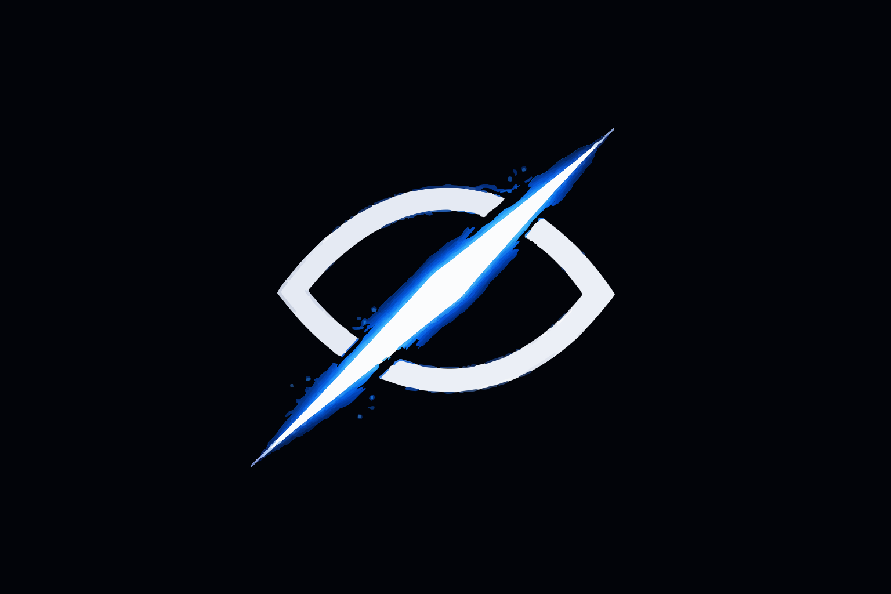

<p align="center">
  <picture>
    <source media="(prefers-color-scheme: dark)" srcset="demo/public/logo.svg">
    
  </picture>
</p>

<h1 align="center">StellaRay</h1>

<p align="center">
ZK authentication and privacy layer for Stellar.<br>
Sign in with Google, get a self-custodial wallet, no seed phrase, no extension.
</p>

<p align="center">
  <a href="https://www.npmjs.com/package/@stellar-zklogin/sdk"></a>
  <a href="LICENSE"></a>
  <a href="https://stellaray.fun"></a>
</p>

<br>

## What StellaRay Does

StellaRay is a zkLogin layer for Stellar. A user signs in with Google and walks away with a self-custodial Stellar wallet in under ten seconds. Three-line SDK integration for any Stellar dApp.

Beyond authentication, StellaRay ships an eligibility-proof framework that lets any Soroban contract verify private user state (solvency above a threshold, KYC-lite, age above N, transaction history above some volume) without seeing the underlying data. That is the part that no passkey wallet or wallet-as-a-service product delivers, and it has no direct competitor on Stellar today.

<br>

## Quick Start

```bash
npm install @stellar-zklogin/sdk
```

```typescript
import { StellarZkLogin } from '@stellar-zklogin/sdk';

const zkLogin = new StellarZkLogin({ network: 'testnet' });
const wallet = await zkLogin.login('google');

console.log(wallet.address); // GDKQ...
await wallet.signTransaction(tx);
```

Three lines. No seed phrase, no extension.

For React apps, the SDK also ships hooks (`useZkLogin`, `useWallet`) and drop-in components (`<LoginButton>`, `<WalletWidget>`).

<br>

## How It Works

```
  Sign in with Google
         |
         v
  Google returns a JWT
         |
         v
  Browser generates ephemeral keypair
         |
         v
  ZK proof: "I own a valid Google JWT with this nonce"
  (sub, email, name stay hidden)
         |
         v
  Soroban contract verifies the proof on-chain
         |
         v
  Ephemeral key registered as wallet signer
```

The wallet address is derived from `Poseidon(sub, aud, salt)`. Same Google account always produces the same Stellar address. The mapping is impossible to reverse without the salt. Google identity never touches the blockchain.

**Privacy properties:**

- OAuth identity never appears on chain
- Same user always gets the same wallet (deterministic)
- Different dApps cannot link a user across applications (salt isolation)
- ZK proof reveals nothing about the user beyond "valid Google JWT exists"

<br>

## Built on Protocol 25

Stellar's Protocol 25 added native cryptographic primitives that make ZK proofs practical on chain. StellaRay is the first project to use them in production smart contracts. Live before Protocol 25 mainnet activation on January 22, 2026.

| | Pre-Protocol 25 (WASM) | Protocol 25 (native) |
|---|---|---|
| Groth16 verification | 4,100,000 instructions | 260,000 instructions |
| Login cost on mainnet | ~$0.50 | **$0.03** |

We use `bn254_g1_add`, `bn254_g1_mul`, `bn254_multi_pairing_check` for elliptic curve operations and `poseidon_permutation` for ZK-friendly hashing. All native Soroban host functions, all running at compiled-code speed.

<br>

## Architecture

```
+---------------------------------------------------+
|                  User's Browser                   |
|     OAuth JWT  >  ZK Proof  >  Ephemeral Keys     |
+--------------------------+------------------------+
                           |
            +--------------+--------------+
            v              v              v
      +-----------+   +----------+   +----------+
      |  Prover   |   |   Salt   |   |  Stellar |
      |  Service  |   |  Cluster |   |  Network |
      +-----------+   +----------+   +----------+
                           |
                           v
+---------------------------------------------------+
|            Soroban Smart Contracts                |
|  ZK Verifier . JWK Registry . Gateway Factory     |
|  Smart Wallet . x402 Facilitator . Multi-Custody  |
+---------------------------------------------------+
```

Six Soroban contracts, all live on Stellar testnet today. The Salt Cluster moves from a single-process service to a 3-of-5 FROST threshold MPC across five cloud providers and five jurisdictions in the next development phase. See `TECHNICAL_ARCHITECTURE.md` for the full design.

<br>

## What You Can Build

**ZK Login**
Google sign-in to a self-custodial Stellar wallet through zero-knowledge cryptography. Apple Sign-In via passkey-backed smart wallet ships next.

**Streaming Payments**
Real-time payment streams between wallets. Pay by the second, cancel anytime. Linear, cliff, exponential, stepped vesting curves. Backed by Soroban escrow contracts.

**Payment Links**
Shareable payment URLs with embedded QR codes. The recipient does not need a wallet beforehand.

**Eligibility Proofs**
Prove things about a user without revealing the underlying data:

- Solvency: balance is above a threshold, without revealing the actual balance
- Identity: a verified KYC identity exists, without exposing email or phone
- Eligibility: age above N, country in a permitted list, accredited-investor status, without revealing the values
- History: transaction count or volume above a minimum, without revealing individual transactions

**x402 Micropayments**
HTTP 402 Payment Required, natively on Stellar. Sub-cent payments per request.

**Multi-Custody Recovery**
Shamir 2-of-3 social recovery. Split wallet access across three guardians; recover with any two.

**React Integration**
Pre-built `<LoginButton>`, `<WalletWidget>`, hooks `useZkLogin()` and `useWallet()`. Drop into any React app.

<br>

## Performance

| Metric | Value |
|---|---|
| Browser proof generation | 2 to 4 s |
| Rust proof generation | 1 to 2 s |
| Stellar ledger close | 3 to 5 s |
| First login (full flow) | 8 to 10 s |
| Return login | 3 to 5 s |
| On-chain verification | ~12 ms, ~$0.03 |
| Proof size | 256 bytes |

<br>

## Project Structure

```
StellaRay/
├── sdk/                  TypeScript SDK (@stellar-zklogin/sdk)
│   └── src/
│       ├── core/         Stellar and Soroban primitives
│       ├── oauth/        Google and Apple OAuth providers
│       ├── react/        React hooks and components
│       ├── x402/         HTTP 402 payment client
│       └── xray/         Protocol 25 instrumentation
├── contracts/            Soroban smart contracts (Rust)
│   ├── zk-verifier/      Groth16 proof verification
│   ├── jwk-registry/     OAuth provider key storage
│   ├── gateway-factory/  Ephemeral signer registration
│   ├── smart-wallet/     Session-based wallet contract
│   ├── x402-facilitator/ HTTP 402 micropayments
│   └── zk-multi-custody/ Shamir 2-of-3 recovery
├── demo/                 Next.js application (stellaray.fun)
├── circuits/             Circom ZK circuits
├── prover/               Proof generation service (Rust)
└── salt-service/         Salt derivation service (Rust)
```

<br>

## Deployed Contracts (Testnet)

| Contract | Address |
|---|---|
| ZK Verifier | [CDAQXH...CP6](https://stellar.expert/explorer/testnet/contract/CDAQXHNK2HZJJE6EDJAO3AWM6XQSM4C3IRB5R3AJSKFDRK4BZ77PACP6) |
| JWK Registry | [CAMO5L...S2I](https://stellar.expert/explorer/testnet/contract/CAMO5LYOANZWUZGJYNEBOAQ6SAQKQO3WBLTDBJ6VAGYNMBOIUOVXGS2I) |
| Gateway Factory | [CAAOQR...F76](https://stellar.expert/explorer/testnet/contract/CAAOQR7L5UVV7CZVYDS5IU72JKAUIEUBLTVLYGTBGBENULLNM3ZJIF76) |
| x402 Facilitator | [CDJMT4...TZZ](https://stellar.expert/explorer/testnet/contract/CDJMT4P4DUZVRRLTF7Z3WCXK6YJ57PVB6K7FUCGW7ZOI5LDFAWBWTTZZ) |
| Smart Wallet (WASM hash) | `2a7e72543da92134de77821c920b82e6c5fb7cd02b5283cfeb87deb894e14d5d` |
| ZK Multi-Custody | live on testnet, full Shamir 2-of-3 flow at [stellaray.fun/zk-multi-custody](https://stellaray.fun/zk-multi-custody) |

<br>

## Run Locally

**Prerequisites:** Node.js 20+, Rust 1.75+, pnpm

```bash
git clone https://github.com/Adwaitbytes/StellaRay.git
cd StellaRay
```

```bash
# Run the demo app
cd demo
pnpm install
pnpm dev
# Open http://localhost:3000
```

```bash
# Build the SDK
cd sdk && pnpm install && pnpm build

# Build the contracts
cd contracts && cargo build --release --target wasm32-unknown-unknown

# Run tests
cd sdk && pnpm test
```

<br>

## Roadmap

The current roadmap aligns with the SCF #43 grant. See `docs/ROADMAP.md` for the full schedule.

**Tranche 1 (July 2026):** Distributed salt MPC. 3-of-5 FROST threshold cluster operated by StellaRay across AWS, GCP, Azure, DigitalOcean, Hetzner in five jurisdictions. SDK v2.5 drops in transparently.

**Tranche 2 (August 2026):** Developer ecosystem builds. Production xray Protocol 25 observability dashboard, SEP-7 transaction signing, on-chain quest framework, public Stellar contract explorer, Apple Sign-In via passkey, full documentation portal with sample dApps and migration guides.

**Tranche 3 (September 2026):** Audited mainnet launch. All six contracts on Stellar mainnet, salt cluster promoted to mainnet, SDK v3.0, on-chain protocol revenue activated, 90-day stability report.

<br>

## Documentation

- [`TECHNICAL_ARCHITECTURE.md`](TECHNICAL_ARCHITECTURE.md): full system design, salt MPC plan, security properties
- [`WHITEPAPER.md`](WHITEPAPER.md): cryptographic construction and ZK protocol details
- [`docs/PROTOCOL_25_INTEGRATION.md`](docs/PROTOCOL_25_INTEGRATION.md): Protocol 25 host function usage
- [`docs/BENCHMARKS.md`](docs/BENCHMARKS.md): performance numbers across the stack
- [`docs/ROADMAP.md`](docs/ROADMAP.md): quarter-by-quarter schedule
- [`docs/QUICKSTART.md`](docs/QUICKSTART.md): SDK integration walkthrough
- [`docs/DEPLOYMENT.md`](docs/DEPLOYMENT.md): deploy your own instance
- [`docs/TECH_STACK.md`](docs/TECH_STACK.md): every library and protocol used
- [`CONTRIBUTING.md`](CONTRIBUTING.md): how to contribute

<br>

## Contributing

Pull requests welcome. Fork the repo, create a branch, open a PR. See [`CONTRIBUTING.md`](CONTRIBUTING.md) for details.

<br>

## Links

[stellaray.fun](https://stellaray.fun) · [@stellar-zklogin/sdk on npm](https://www.npmjs.com/package/@stellar-zklogin/sdk) · [Twitter / X](https://x.com/stellaraydotfun) · [GitHub](https://github.com/Adwaitbytes/StellaRay)

<br>

<p align="center">
MIT License
</p>
