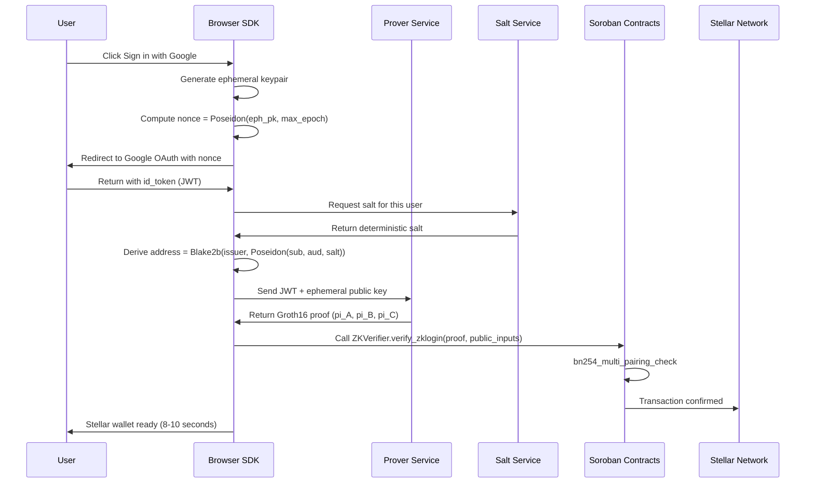

# StellaRay Technical Architecture
## ZK Authentication and Privacy Layer for Stellar

**Live demo:** https://stellaray.fun
**SDK:** https://www.npmjs.com/package/@stellar-zklogin/sdk
**GitHub:** https://github.com/Adwaitbytes/StellaRay

---

## 1. Overview

StellaRay replaces seed phrases with Google Sign-In. A user clicks "Sign in with Google," their OAuth token is processed into a Groth16 zero-knowledge proof, and that proof is verified on-chain inside a Soroban smart contract. The result is a self-custodial Stellar wallet in under 10 seconds. No seed phrase. No browser extension. The Google identity never appears on-chain.

The system has four layers that build on each other:

- **ZK Wallet** — Google OAuth to Stellar wallet using Protocol 25's native BN254 and Poseidon host functions
- **Payments** — streaming payments, shareable payment links, and x402 micropayments settled on Stellar
- **Near Intent** — ZK proof gates that let any Soroban contract verify private user state without seeing the underlying data
- **Multi-Custody Recovery** — Shamir 2-of-3 social recovery so users never permanently lose wallet access

Everything is live on Stellar testnet. Five Soroban contracts are deployed and verifiable on stellar.expert right now. The SDK is published on npm and any Stellar dApp can integrate ZK login today.

---

## 2. Why Protocol 25 Changes Everything

Protocol 25 (Stellar's X-Ray upgrade) added native BN254 elliptic curve operations and Poseidon hashing directly into the Soroban host. Before Protocol 25, verifying a Groth16 proof on Stellar required a WASM implementation that cost roughly 4.1 million instructions. With native host functions, the same verification costs around 260,000 instructions. That is a 94% reduction.

This matters because ZK proofs were previously too expensive for practical use on Stellar. Protocol 25 makes them viable at scale.

StellaRay uses three Protocol 25 host functions:

- `bn254_g1_mul` for scalar multiplication during public input accumulation
- `bn254_g1_add` for point addition in the multi-scalar multiplication step
- `bn254_multi_pairing_check` for the final Groth16 pairing equation
- `poseidon_permutation` for ZK-friendly address derivation and identity commitments

We are the first project on Stellar to use these in deployed production contracts. Protocol 25 shipped to Stellar mainnet on January 22, 2026. StellaRay was ready.

---

## 3. ZK Wallet Architecture

### How the Login Flow Works

The core idea is that a Google JWT can be used as a private input to a ZK circuit. The circuit proves "this person has a valid Google account" without revealing which Google account. The on-chain wallet address is derived from a one-way hash of the user's identity and a private salt, so two dApps cannot link the same user across applications.



### What the ZK Circuit Proves

The Groth16 circuit takes private inputs that never leave the user's browser and produces a proof that can be verified on-chain. The circuit proves four things simultaneously:

1. The JWT was signed by Google (RSA verification inside the ZK circuit)
2. The nonce in the JWT matches the ephemeral public key and session epoch
3. The wallet address seed is correctly derived from the user's identity and salt
4. The proof is bound to this specific ephemeral key and expires at max_epoch

**Public inputs (what goes on-chain, 5 elements):**
- `eph_pk_hash` - Poseidon hash of the ephemeral public key
- `max_epoch` - the Stellar ledger number when this session expires
- `address_seed` - Poseidon(sub, aud, Poseidon(salt)) — the wallet address commitment
- `iss_hash` - hash of the OAuth issuer string
- `jwk_modulus_hash` - Poseidon hash of Google's current signing key

**Private inputs (stay in browser, never transmitted):**
- Raw JWT payload
- Google user ID (sub)
- User salt
- Ephemeral private key
- RSA signature from Google

### Address Derivation

The wallet address is fully deterministic. The same Google account always produces the same Stellar address:

```
address_seed = Poseidon("sub", google_sub, google_aud, Poseidon(salt))
stellar_address = Blake2b(concat(issuer, address_seed))
```

The salt is derived by the Salt Service as HMAC-SHA256(master_secret, sub + aud). It is the same every time the user logs in, which is why the wallet address is always recovered. The master secret never leaves the Salt Service.

### Why This Is Self-Custodial

The wallet is not custodial. The user signs transactions using their ephemeral private key, which is generated in the browser and never transmitted anywhere. The ZK proof is what proves the ephemeral key belongs to a valid Google user. The Soroban smart wallet contract verifies the proof before executing any operation, replacing the traditional "check the signature against a known public key" pattern with "verify this zero-knowledge proof."

---

## 4. Soroban Smart Contracts

StellaRay uses five Soroban contracts, all deployed on Stellar testnet.

| Contract | Address |
|---|---|
| ZK Verifier | CDAQXHNK2HZJJE6EDJAO3AWM6XQSM4C3IRB5R3AJSKFDRK4BZ77PACP6 |
| JWK Registry | CAMO5LYOANZWUZGJYNEBOAQ6SAQKQO3WBLTDBJ6VAGYNMBOIUOVXGS2I |
| Gateway Factory | CAAOQR7L5UVV7CZVYDS5IU72JKAUIEUBLTVLYGTBGBENULLNM3ZJIF76 |
| x402 Facilitator | CDJMT4P4DUZVRRLTF7Z3WCXK6YJ57PVB6K7FUCGW7ZOI5LDFAWBWTTZZ |
| Smart Wallet | WASM hash: 2a7e72543da92134de77821c920b82e6c5fb7cd02b5283cfeb87deb894e14d5d |

### ZK Verifier

This is the core contract. It implements Groth16 verification using Protocol 25 host functions. When called, it runs the pairing equation that checks whether the submitted proof is valid for the given public inputs.

```rust
pub fn verify_zklogin(
    env: Env,
    proof: Groth16Proof,
    public_inputs: Vec<U256>,
    max_epoch: u64,
) -> bool {
    // Check session has not expired
    assert!(env.ledger().sequence() <= max_epoch);

    // Check nullifier to prevent replay attacks
    let nullifier = env.crypto().poseidon_hash(&public_inputs[2..3]);
    assert!(!is_nullifier_used(&env, &nullifier));

    // Accumulate public inputs using MSM
    let mut vk_x = verification_key.ic[0].clone();
    for (i, pub_input) in public_inputs.iter().enumerate() {
        let term = env.crypto().bn254_g1_mul(&vk.ic[i+1], &pub_input);
        vk_x = env.crypto().bn254_g1_add(&vk_x, &term);
    }

    // Final pairing check: e(-A, B) * e(alpha, beta) * e(vk_x, gamma) * e(C, delta) == 1
    let valid = env.crypto().bn254_multi_pairing_check(&[
        (-proof.a, proof.b),
        (vk.alpha, vk.beta),
        (vk_x, vk.gamma),
        (proof.c, vk.delta),
    ]);

    if valid { mark_nullifier_used(&env, &nullifier); }
    valid
}
```

### JWK Registry

Google rotates its JWT signing keys periodically. The JWK Registry stores the Poseidon hash of each authorized key modulus. When a user logs in, the circuit proves the JWT was signed by a key whose hash is in the registry. This means if Google rotates a key, we can update the registry without redeploying the verifier contract.

### Smart Wallet

The Smart Wallet contract is what users actually own. It executes Stellar operations when presented with a valid ZK proof, replacing the traditional keypair signature with a ZK proof verification. This means the user's Google account is the "key," but Google never has custody.

```rust
pub fn execute(
    env: Env,
    proof: Groth16Proof,
    public_inputs: Vec<U256>,
    operations: Vec<Operation>,
    max_epoch: u64,
) -> Result<(), WalletError> {
    let valid = zk_verifier::verify_zklogin(&env, proof, public_inputs, max_epoch);
    require(valid, WalletError::InvalidProof);
    for op in operations { env.invoke_contract(&stellar_asset_contract, &op); }
    Ok(())
}
```

---

## 5. Payment Layer

### Streaming Payments

Streaming payments allow funds to flow by the second. A sender locks XLM or any Stellar asset into a Soroban escrow contract. The contract calculates how much the recipient has earned at any moment based on the elapsed time and the selected payment curve. The recipient can withdraw whenever they want.

Supported curves are linear (salary, subscriptions), cliff (vesting), exponential (incentive programs), and step (milestone-based).

Stellar integration: every withdrawal and cancellation is a real Stellar transaction using `Operation.payment` submitted through Horizon. Soroban contract storage tracks the stream state and enforces the rules.

### Payment Links

Shareable URLs that encode a Stellar address, amount, asset, and optional memo. The payer opens the link, optionally creates a ZK wallet in the same flow, and pays. No prior wallet installation required.

Stellar integration: the underlying transaction uses `TransactionBuilder` with `Operation.payment` submitted to Horizon. Works with XLM and any Stellar asset.

### x402 Micropayments

An HTTP-native micropayment protocol for pay-per-request use cases. When a client requests a resource, the server responds with 402 Payment Required and the payment details. The client makes a Stellar payment and retries with the transaction hash. The x402 Facilitator contract handles atomic on-chain settlement.

Stellar's sub-cent fees make this economically viable at 0.001 XLM per request.

---

## 6. Near Intent (ZK Proof Gates)

Near Intent is a composable Soroban building block. Any contract can call `verify_eligibility_proof()` on the ZK Verifier to gate access based on private user state, without ever seeing the actual data.

Four proof types are supported:

**Solvency** — proves a wallet balance is above a threshold without revealing the actual balance. The on-chain public inputs are a Poseidon hash of the threshold and a commitment to the actual balance. The circuit proves `actual_balance >= threshold` in zero-knowledge.

**Identity** — proves verified identity (KYC-lite, proof of humanity) without revealing email, phone, or any personal data. The public input is an `identityCommitment = Poseidon(email, sub, salt)`.

**Eligibility** — proves arbitrary criteria (age, country, membership status) without revealing the underlying attributes.

**History** — proves transaction count or volume above a minimum threshold without revealing individual transactions.

All four proof types use the same ZK Verifier contract and Protocol 25 host functions. The circuit and public inputs differ per proof type, but the on-chain verification call is identical.

---

## 7. ZK Multi-Custody Recovery

If a user loses access to their Google account, they can recover their wallet through a Shamir 2-of-3 secret sharing scheme.

During setup, the wallet's underlying secret is split into three shares. Each share is encrypted to one of three guardian Stellar addresses and stored in the multi-custody Soroban contract. If the user needs to recover, they contact two of their three guardians. Each guardian decrypts their share. The two shares are combined using Shamir's formula over GF(256) to reconstruct the original secret, and a new ZK wallet session is created.

Guardian approvals are on-chain state transitions in the multi-custody contract, so the recovery process is auditable and cannot be faked by a single party.

---

## 8. Supporting Services

### Prover Service

A Rust service running at `prover.zklogin.stellaray.fun` that takes a JWT and ephemeral public key and returns a Groth16 proof. Proof generation takes 2 to 4 seconds. The prover never sees the user's salt or private key. It only sees the JWT and ephemeral public key, neither of which is a secret, so the ZK property is preserved even if the prover service is compromised.

```
POST /prove
{
  "jwt": "<id_token>",
  "ephemeralPublicKey": "<hex>",
  "maxEpoch": 12345,
  "salt": "<hex>",
  "network": "testnet"
}
```

### Salt Service

A Rust service running at `salt.zklogin.stellaray.fun` that derives a deterministic per-user salt as `HMAC-SHA256(master_secret, sub + aud)`. The master secret never leaves the service. The salt is the same every time the same Google account logs in, which is what makes the wallet address deterministic and recoverable.

Before returning a salt, the service verifies the JWT signature against Google's public JWK keys, preventing salt enumeration attacks.

---

## 9. TypeScript SDK

The `@stellar-zklogin/sdk` npm package wraps the full system. A Stellar dApp can add ZK Google login in three lines:

```typescript
import { StellarZkLogin } from '@stellar-zklogin/sdk';

const zkLogin = new StellarZkLogin({ network: 'mainnet' });
const wallet = await zkLogin.login('google');
// wallet.address → "GDKQ...XMVB"
// wallet.signTransaction() → signs with ZK proof, no seed phrase
```

The SDK also exports React hooks (`useZkLogin`, `useWallet`) and drop-in components (`LoginButton`, `WalletWidget`) for fast integration.

Deployed contract addresses for both networks are exported as `TESTNET_CONTRACTS` and `MAINNET_CONTRACTS`.

---

## 10. Security Properties

**No identity on-chain.** The Google sub and email never appear in any transaction or contract storage. The wallet address is derived from a one-way Poseidon hash that cannot be reversed.

**Replay protection.** Every ZK proof contains a unique nullifier derived from the ephemeral public key. The ZK Verifier contract tracks used nullifiers and rejects any proof submitted twice.

**Session expiry.** Every proof is bound to a max_epoch (Stellar ledger number). Proofs expire automatically when the ledger advances past max_epoch.

**Key rotation support.** Google rotates its JWK signing keys periodically. The JWK Registry contract handles this gracefully. Old keys can be revoked, new keys registered, without touching the verifier contract.

**Prover cannot steal funds.** The prover only receives a JWT and ephemeral public key. It cannot derive the user's salt or wallet key. A compromised prover cannot move user funds.

---

## 11. Performance

| Step | Time |
|---|---|
| Ephemeral keypair generation | under 10ms |
| Google OAuth redirect and authentication | roughly 3 seconds (user action) |
| Salt derivation | roughly 200ms |
| Groth16 proof generation | 2 to 4 seconds |
| Soroban transaction build and submit | roughly 600ms |
| Stellar ledger confirmation | roughly 5 seconds |
| Total login to wallet ready | 8 to 10 seconds |

| Metric | Value |
|---|---|
| On-chain verification cost (Protocol 25) | 260,000 instructions |
| On-chain verification cost (WASM baseline) | 4,100,000 instructions |
| Gas savings from Protocol 25 | 94% |
| Cost per login (XLM fees) | approximately $0.03 |

---

## 12. Mainnet Deployment Plan

Mainnet deployment requires a trusted setup ceremony for all ZK circuits (Powers of Tau + circuit-specific phase 2), followed by deploying all five contracts to `Networks.PUBLIC` with the production verification keys. The SDK `MAINNET_CONTRACTS` object will be updated with the deployed addresses on mainnet. A security audit of all contracts will be completed before public launch.

The deployment checklist:

1. Complete trusted setup ceremony for all circuits
2. Deploy ZK Verifier to mainnet with production verification key
3. Deploy JWK Registry with current Google JWK modulus hashes
4. Deploy Gateway Factory, Smart Wallet, x402 Facilitator, and ZK Multi-Custody
5. Update SDK MAINNET_CONTRACTS with all deployed addresses
6. Complete security audit (all contracts)
7. Production prover service with p95 under 5 seconds
8. Professional UX testing with real users
9. Public launch targeting 100 unique mainnet wallets in the first 30 days

---

## 13. API Reference

**Authentication**

| Endpoint | Method | Description |
|---|---|---|
| /api/zk/salt | POST | Get deterministic salt for address derivation |
| /api/zk/prove | POST | Generate Groth16 ZK proof |
| /api/zk/verify | POST | Verify a ZK proof via Soroban |
| /api/auth/[...nextauth] | GET/POST | Google OAuth callback |

**Payments**

| Endpoint | Method | Description |
|---|---|---|
| /api/pay/create | POST | Create shareable payment link |
| /api/pay/[id] | GET | Fetch payment link details |
| /api/pay/history | GET | User payment history |
| /api/streams/create | POST | Create streaming payment |
| /api/streams/[id] | GET | Get stream state |
| /api/streams/[id]/withdraw | POST | Withdraw earned amount |
| /api/streams/[id]/cancel | POST | Cancel stream |
| /api/streams/history | GET | User stream history |

**ZK Proof Gates**

| Endpoint | Method | Description |
|---|---|---|
| /api/zk-proofs/generate | POST | Generate eligibility or solvency proof |
| /api/zk-proofs/verify | POST | Verify proof on-chain |

**Multi-Custody**

| Endpoint | Method | Description |
|---|---|---|
| /api/multi-custody/create | POST | Create multi-custody wallet |
| /api/multi-custody/initiate | POST | Initiate recovery request |
| /api/multi-custody/approve | POST | Guardian approves recovery |
| /api/multi-custody/execute | POST | Execute recovery after threshold met |
| /api/multi-custody/pending | GET | List pending recovery requests |

---

*Contact: adwaitkeshari288@gmail.com*
*GitHub: https://github.com/Adwaitbytes/StellaRay*
